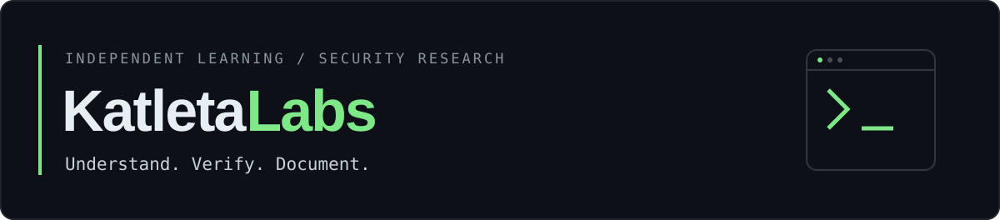

**Security research · Web security · Reverse engineering**

## About

I study application security, reverse engineering, and penetration testing.
My current learning focus is cryptography and advanced networking.

I aim to document security work with reproducible steps,
clear scope, and practical remediation.

## Toolkit

<!--
Uncomment the Platforms section after replacing the placeholders
with your actual profile URLs. Remove platforms you do not use.

## Platforms

-->

<!--
Add this section when the repositories are public and documented.
Replace the example names and descriptions with actual projects.

## Selected work

- [PROJECT_NAME](PROJECT_URL) — problem solved, approach, and outcome.
- [PROJECT_NAME](PROJECT_URL) — problem solved, approach, and outcome.
- [Credentials](https://github.com/KatletaLabs/infosec-credentials) — certifications and verification links.
-->

## GitHub activity

## Contact

[Telegram · @ovekekk](https://t.me/ovekekk)

<!--
Optional: add an email address intended for public contact.

[Email](mailto:YOUR_PUBLIC_EMAIL)

For encrypted communication, upload only your PUBLIC PGP key
to keys/pgp-public.asc, then add the link and full fingerprint:

[PGP public key](keys/pgp-public.asc)
Fingerprint: FULL_PUBLIC_KEY_FINGERPRINT
-->
